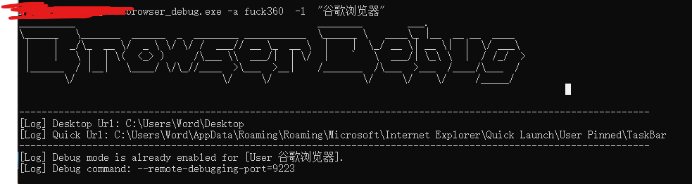

# ChromeDebugLnk

## 中文介绍

**ChromeDebugLnk** 是一个基于 Go 语言开发的 Windows 工具，专门用于修改桌面、任务栏或用户指定路径中的浏览器快捷方式（支持 Chrome、Edge 和 Opera），以启用远程调试模式。该工具需要以管理员权限（UAC）运行，以绕过如 360 安全卫士等安全软件的限制，允许无缝修改快捷方式的属性。此外，它还提供通过修改 Windows 注册表来限制 Chrome 浏览器隐身模式的功能，适合需要特定浏览器配置的开发或管理场景。

## 运行截图

### 主要功能
1. **快捷方式修改**：
    - 为 Chrome、Edge 或 Opera 浏览器的快捷方式添加远程调试参数（`--remote-debugging-port` 和 `--remote-allow-origins=*`）。
    - 支持修改桌面、公共桌面、任务栏或用户自定义路径中的快捷方式。
    - 自动检测快捷方式是否已启用调试模式，若已启用则跳过修改。
    - 调试端口会自动递增以避免冲突（默认端口为 `9222`）。

2. **限制 Chrome 隐身模式**：
    - 通过修改注册表（`HKEY_LOCAL_MACHINE\SOFTWARE\Policies\Google\Chrome`）来禁用 Chrome 的隐身模式。
    - 支持移除已设置的隐身模式限制（通过 `-nobypass` 参数）。

3. **自定义支持**：
    - 支持通过 `-u` 参数指定用户名，定位特定用户的桌面路径。
    - 支持通过 `-path` 参数指定任意快捷方式路径。
    - 支持通过 `-l` 参数指定特定的快捷方式名称（如 `Google Chrome.lnk`）。

4. **安全性与隐形操作**：
    - 程序运行需要输入特定密码（`fuck360`），以防止未经授权的执行。
    - 支持在完成修改后自动删除自身（通过 `utils.DeleteSelf()`），实现隐形操作。

5. **权限检查**：
    - 程序会检查是否以管理员权限运行，若权限不足则会提示并退出。

### 使用方法
程序通过命令行参数运行，以下是可用参数的详细说明：
- `-a <password>`：运行密码，必须为 `fuck360`，否则程序退出。
- `-p <port>`：指定远程调试端口，默认为 `9222`。
- `-l <name>`：指定要修改的快捷方式名称（例如 `Google Chrome`）。
- `-u <username>`：指定目标用户名，定位其桌面路径（例如 `User1`）。
- `-path <path>`：指定自定义快捷方式路径（例如 `C:\Users\User1\Desktop\Google Chrome.lnk`）。
- `-bypass`：启用 Chrome 隐身模式限制（修改注册表）。
- `-nobypass`：移除 Chrome 隐身模式限制。

#### 示例
1. 修改默认桌面上的 Chrome 快捷方式，启用调试模式：
   ```bash
   ChromeDebugLnk.exe -a fuck360 -p 9222
   ```

2. 修改指定用户的 Chrome 快捷方式：
   ```bash
   ChromeDebugLnk.exe -a fuck360 -u User1 -l "Google Chrome"
   ```

3. 启用 Chrome 隐身模式限制：
   ```bash
   ChromeDebugLnk.exe -a fuck360 -bypass
   ```

4. 修改指定路径的快捷方式：
   ```bash
   ChromeDebugLnk.exe -a fuck360 -path "C:\Users\Public\Desktop\Google Chrome.lnk"
   ```
## 如何编译
```go
go build -o ChromeDebugLnk.exe -ldflags "-w -s" main.go
```

### 注意事项
- **权限要求**：程序必须以管理员权限运行，否则会因 UAC 权限不足而退出。
- **注册表修改**：启用或移除隐身模式限制后，需重启 Chrome 浏览器以生效。
- **端口冲突**：程序会自动递增端口号以避免冲突，但建议检查端口是否被占用。
- **快捷方式路径**：确保指定的快捷方式文件存在，否则程序会跳过不存在的文件。
- **安全性**：密码验证和自删除功能确保程序的安全性和隐形性，适合在受控环境中使用。

### 依赖
- **Go 语言**：程序使用 Go 语言开发，依赖 `go-ole` 库来操作 Windows COM 组件以修改快捷方式。
- **Windows 系统**：仅支持 Windows 系统，因为依赖 Windows 的快捷方式（`.lnk` 文件）和注册表操作。

### 英文文档
For the English version of this README, please refer to [README_EN.md](README_EN.md).

## English Introduction
For a detailed English introduction, please see [README_EN.md](README_EN.md).
